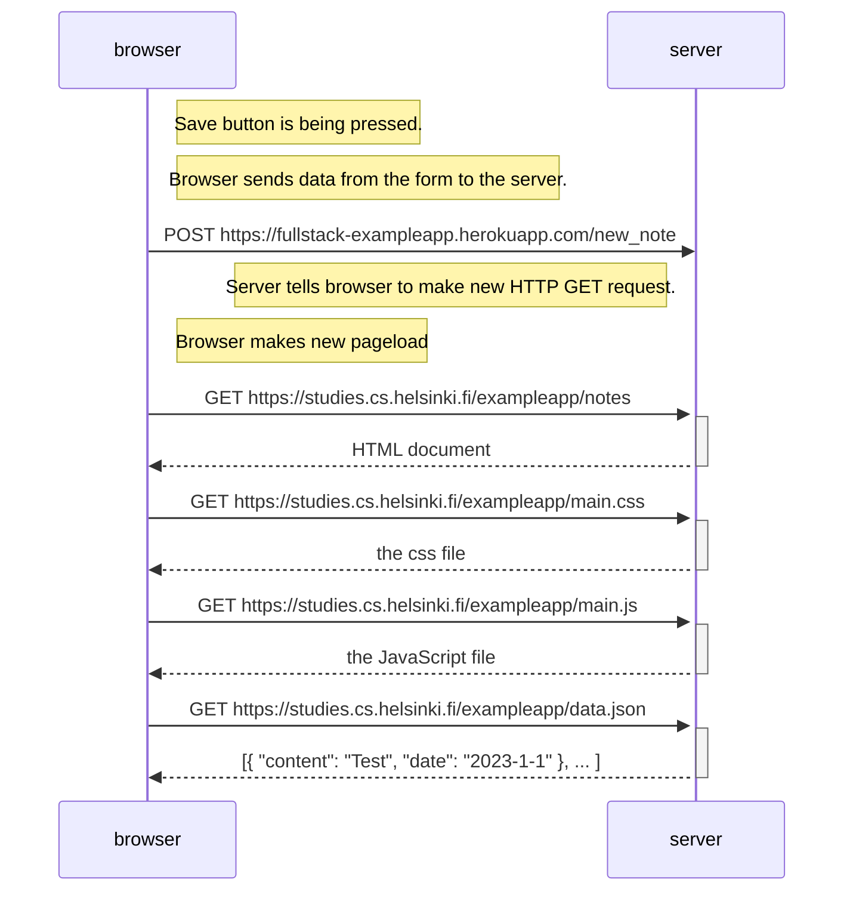

# 0.4

```mermaid

sequenceDiagram
    participant b as browser
    participant s as server

    Note right of b: Save button is being pressed.
    Note right of b: Browser sends data from the form to the server.
    b->>s: POST https://fullstack-exampleapp.herokuapp.com/new_note
    activate s

    Note left of s: Server tells browser to make new HTTP GET request.
    Note right of b: Browser makes new pageload
    
    b->>s: GET https://studies.cs.helsinki.fi/exampleapp/notes
    activate s
    s-->>b: HTML document
    deactivate s
    
    b->>s: GET https://studies.cs.helsinki.fi/exampleapp/main.css
    activate s
    s-->>b: the css file
    deactivate s
    
    b->>s: GET https://studies.cs.helsinki.fi/exampleapp/main.js
    activate s
    s-->>b: the JavaScript file
    deactivate s

    b->>s: GET https://studies.cs.helsinki.fi/exampleapp/data.json
    activate s
    s-->>b: [{ "content": "Test", "date": "2023-1-1" }, ... ]
    deactivate s 
```
